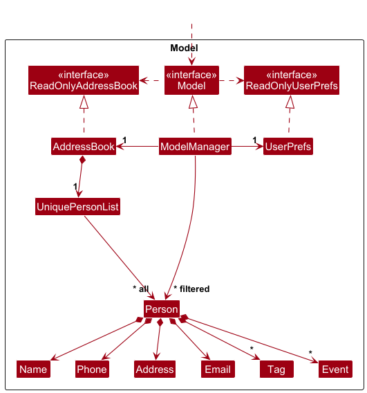

## Table of Contents

- [Acknowledgements](#acknowledgements)
- [Setting up, getting started](#setting-up-getting-started)
- [Design](#design)
    - [Architecture](#architecture)
    - [UI component](#ui-component)
    - [Logic component](#logic-component)
    - [Model component](#model-component)
    - [Storage component](#storage-component)
    - [Common classes](#common-classes)
- [Implementation](#implementation)
    - [[Proposed] Undo/redo feature](#proposed-undoredo-feature)
    - [[Proposed] Data archiving](#proposed-data-archiving)
- [Documentation, logging, testing, configuration, dev-ops](#documentation-logging-testing-configuration-dev-ops)
- [Appendix: Requirements](#appendix-requirements)
    - [Product scope](#product-scope)
    - [User stories](#user-stories)
    - [Use cases](#use-cases)
    - [Non-functional requirements](#non-functional-requirements)
    - [Glossary](#glossary)
- [Appendix: Instructions for manual testing](#appendix-instructions-for-manual-testing)
    - [Launch and shutdown](#launch-and-shutdown)
    - [Deleting a person](#deleting-a-person)

--------------------------------------------------------------------------------------------------------------------

## **Acknowledgements**

* {list here sources of all reused/adapted ideas, code, documentation, and third-party libraries -- include links to the original source as well}

--------------------------------------------------------------------------------------------------------------------

## **Setting up, getting started**

Refer to the guide [_Setting up and getting started_](SettingUp.md).

--------------------------------------------------------------------------------------------------------------------

## **Design**

:bulb: **Tip:** The `.puml` files used to create diagrams are in this document `docs/diagrams` folder. Refer to the [_PlantUML Tutorial_ at se-edu/guides](https://se-education.org/guides/tutorials/plantUml.html) to learn how to create and edit diagrams.

### Architecture

The ***Architecture Diagram*** given above explains the high-level design of the App.

Given below is a quick overview of main components and how they interact with each other.

**Main components of the architecture**

**`Main`** (consisting of classes [`Main`](https://github.com/AY2526S1-CS2103T-T13-1/tp/blob/master/src/main/java/seedu/address/Main.java) and [`MainApp`](https://github.com/AY2526S1-CS2103T-T13-1/tp/blob/master/src/main/java/seedu/address/MainApp.java)) is in charge of the app launch and shut down.
* At app launch, it initializes the other components in the correct sequence, and connects them up with each other.
* At shut down, it shuts down the other components and invokes cleanup methods where necessary.

The bulk of the app's work is done by the following four components:

* [**`UI`**](#ui-component): The UI of the App.
* [**`Logic`**](#logic-component): The command executor.
* [**`Model`**](#model-component): Holds the data of the App in memory.
* [**`Storage`**](#storage-component): Reads data from, and writes data to, the hard disk.

[**`Commons`**](#common-classes) represents a collection of classes used by multiple other components.

**How the architecture components interact with each other**

The *Sequence Diagram* below shows how the components interact with each other for the scenario where the user issues the command `delete 1`.

Note that a similar style is used for all commands that modifies the address book using an index.

Each of the four main components (also shown in the diagram above),

* defines its *API* in an `interface` with the same name as the Component.
* implements its functionality using a concrete `{Component Name}Manager` class (which follows the corresponding API `interface` mentioned in the previous point.

For example, the `Logic` component defines its API in the `Logic.java` interface and implements its functionality using the `LogicManager.java` class which follows the `Logic` interface. Other components interact with a given component through its interface rather than the concrete class (reason: to prevent outside component's being coupled to the implementation of a component), as illustrated in the (partial) class diagram below.

The sections below give more details of each component.

### UI component

The **API** of this component is specified in [`Ui.java`](https://github.com/AY2526S1-CS2103T-T13-1/tp/blob/master/src/main/java/seedu/address/ui/Ui.java)

The UI consists of a `MainWindow` that is made up of parts e.g.`CommandBox`, `ResultDisplay`, `PersonListPanel`, `StatusBarFooter` etc. All these, including the `MainWindow`, inherit from the abstract `UiPart` class which captures the commonalities between classes that represent parts of the visible GUI.

The `UI` component uses the JavaFx UI framework. The layout of these UI parts are defined in matching `.fxml` files that are in the `src/main/resources/view` folder. For example, the layout of the [`MainWindow`](https://github.com/AY2526S1-CS2103T-T13-1/tp/blob/master/src/main/java/seedu/address/ui/MainWindow.java) is specified in [`MainWindow.fxml`](https://github.com/AY2526S1-CS2103T-T13-1/tp/blob/master/src/main/resources/view/MainWindow.fxml)

The `UI` component,

* executes user commands using the `Logic` component.
* listens for changes to `Model` data so that the UI can be updated with the modified data.
* keeps a reference to the `Logic` component, because the `UI` relies on the `Logic` to execute commands.
* depends on some classes in the `Model` component, as it displays `Person` object residing in the `Model`.

### Logic component

**API** : [`Logic.java`](https://github.com/AY2526S1-CS2103T-T13-1/tp/blob/master/src/main/java/seedu/address/logic/Logic.java)

Here's a (partial) class diagram of the `Logic` component:

The sequence diagram below illustrates the interactions within the `Logic` component, taking `execute("pin ARG")` API call as an example.
This is a common format used by commands that modify the stored contacts using an INDEX or a NAME.

How the `Logic` component works:

1. When `Logic` is called upon to execute a command, it is passed to an `AddressBookParser` object which in turn creates a parser that matches the command (e.g., `PinCommandParser`) and uses it to parse the command.
1. This results in a `Command` object (more precisely, an object of one of its subclasses e.g., `PinCommand`) which is executed by the `LogicManager`.
1. The command can communicate with the `Model` when it is executed (e.g. to delete a person). 
   Note that although this is shown as a single step in the diagram above (for simplicity), in the code it can take several interactions (between the command object and the `Model`) to achieve.
1. The result of the command execution is encapsulated as a `CommandResult` object which is returned back from `Logic`.

Here are the other classes in `Logic` (omitted from the class diagram above) that are used for parsing a user command:

How the parsing works:
* When called upon to parse a user command, the `AddressBookParser` class creates an `XYZCommandParser` (`XYZ` is a placeholder for the specific command name e.g., `AddCommandParser`) which uses the other classes shown above to parse the user command and create a `XYZCommand` object (e.g., `AddCommand`) which the `AddressBookParser` returns back as a `Command` object.
* All `XYZCommandParser` classes (e.g., `AddCommandParser`, `DeleteCommandParser`, ...) inherit from the `Parser` interface so that they can be treated similarly where possible e.g, during testing.

### Model component
**API** : [`Model.java`](https://github.com/AY2526S1-CS2103T-T13-1/tp/blob/master/src/main/java/seedu/address/model/Model.java)

:information_source: **Note:** The address field shown here is still in the program,
though from the user standpoint, it has been repurposed to store the contact organisation in accordance with our problem domain.  

The `Model` component,

* stores the address book data i.e., all `Person` objects (which are contained in a `UniquePersonList` object).
* stores the currently 'selected' `Person` objects (e.g., results of a search query) as a separate _filtered_ list which is exposed to outsiders as an unmodifiable `ObservableList<Person>` that can be 'observed' e.g. the UI can be bound to this list so that the UI automatically updates when the data in the list change.
* stores a `UserPref` object that represents the user’s preferences. This is exposed to the outside as a `ReadOnlyUserPref` objects.
* does not depend on any of the other three components (as the `Model` represents data entities of the domain, they should make sense on their own without depending on other components)

:information_source: **Note:** An alternative (arguably, a more OOP) model is given below. It has a `Tag` list in the `AddressBook`, which `Person` references. This allows `AddressBook` to only require one `Tag` object per unique tag, instead of each `Person` needing their own `Tag` objects. 

### Storage component

**API** : [`Storage.java`](https://github.com/AY2526S1-CS2103T-T13-1/tp/blob/master/src/main/java/seedu/address/storage/Storage.java)

The `Storage` component,
* can save both address book data and user preference data in JSON format, and read them back into corresponding objects.
* inherits from both `AddressBookStorage` and `UserPrefStorage`, which means it can be treated as either one (if only the functionality of only one is needed).
* depends on some classes in the `Model` component (because the `Storage` component's job is to save/retrieve objects that belong to the `Model`)

### Common classes

Classes used by multiple components are in the `seedu.address.commons` package.

--------------------------------------------------------------------------------------------------------------------

## **Implementation**

This section describes some noteworthy details on how certain features are implemented.

### Upcoming Events and Reminders feature

The "upcoming events" feature is implemented in two distinct ways to serve different user needs,
acting as a reminder for events happening on the current or next day:

1.  **An auto-updating dashboard panel** ("Upcoming Events" box in `SummaryDashboard`) which provides information on the next 3 upcoming events at a glance.
2.  **An `remind` command** which provides a comprehensive, detailed list of *all* events for today and tomorrow in the result display.

#### Implementation: Summary Dashboard Panel

The dashboard panel is designed to be a "live" UI component that automatically reflects the current state of the address book.

* **Mechanism:** The `SummaryDashboard` class is instantiated by `MainWindow` and receives the `ObservableList<Person>` from `Model`.
* **Update Trigger:** A `ListChangeListener` is attached to this list. Any command that modifies the `Person` list (e.g., `add`, `edit`, `delete`, `pin`, or `event`) triggers this listener.
  * This update is not only for this feature, but also supports the other dashboard displays.
* **Logic:** The listener calls `updateDashboard()`, which in turn calls `updateUpcomingEvents()`.
* **Filtering:** The `findUpcomingEvents()` helper method iterates through all persons and their events, specifically filtering for events that **start today or tomorrow** (`eventDate.isEqual(today) || eventDate.isEqual(tomorrow)`).
* **Sorting:** Compiles the list of `Pair<Person, Event>` and sorts by the event's start time (earliest first) using `Comparator.comparing()`
* **Display:** The `updateUpcomingEvents()` method then takes this sorted list, and adds up to **3 events** to be displayed (limited due to space constraints).
  * The method further checks if upcomingEvents.size() > 3. If true, a **"`...`"** label is added to the panel to indicate that more events are scheduled but not shown.

The following sequence diagram shows how adding a new event triggers the dashboard update:

---
#### Implementation: Remind Command

The `remind` command is an active, user-triggered query for a complete event log for today and tomorrow.
Follows a similar logic to previous commands.

* **Mechanism:** The user types `remind`. The `AddressBookParser` creates a `RemindCommandParser`, which in turn creates a `RemindCommand` object.
* **Execution:** The `LogicManager` executes the `RemindCommand`.
* **Filtering Logic:** The `execute()` method performs a more comprehensive search than the dashboard. It creates two separate lists:
    1.  **`eventsToday`:** This list includes any event that:
        * Starts or ends today (`isToday`).
        * Spans today (started before today and ends after today) (`hasToday`).
        * Has not already ended (`isAfter(currentDateTime)`).
    2.  **`eventsTomorrow`:** This list includes any event that *starts* tomorrow.
* **Display:** The command sorts both lists by event start time (`EVENT_COMPARATOR`) and formats them into a single `CommandResult` with separate "Today" and "Tomorrow" headings, which is then shown in the result display.

The diagram for `remind` is omitted, as it is very much the same as previous diagrams for `delete` and `pin` already in this guide, with the addition of using a comparator.

---
#### Design considerations: How should upcoming event data be queried?

* **Alternative 1 (Current Choice): Two separate implementations.**
    * **Description:** The application has two different methods for finding "upcoming events" one in `SummaryDashboard.findUpcomingEvents()` and a more complex one in `RemindCommand.execute()`.
    * **Pros:** Each feature is self-contained and tailored to its specific purpose.
    * **Cons:** This results in **code duplication** (both methods iterate all persons and events).

* **Alternative 2 (Future Refactor): Move Logic to Model.**
    * **Description:** A new method (e.g., `getUpcomingEvents(LocalDate date)`) could be added to the `Model` interface, which could then house the filtering logic from `RemindCommand`.
    * **Pros:** Both `RemindCommand` and `SummaryDashboard` would call this method, leading to guaranteed consistent results.
    * **Cons:** Makes the `Model` interface slightly larger and more complex.

* **Alternative 3: Share a Utility Method.**
    * **Description:** A static helper method could be created in a `EventUtil` class that both `RemindCommand` and `SummaryDashboard` can call.
    * **Pros:** Reduces code duplication without modifying the `Model` interface.
    * **Cons:** The logic is still decoupled from the `Model` (the data's owner).

### \[Proposed\] Undo/redo feature

#### Proposed Implementation

The proposed undo/redo mechanism is facilitated by `VersionedAddressBook`. It extends `AddressBook` with an undo/redo history, stored internally as an `addressBookStateList` and `currentStatePointer`. Additionally, it implements the following operations:

* `VersionedAddressBook#commit()` — Saves the current address book state in its history.
* `VersionedAddressBook#undo()` — Restores the previous address book state from its history.
* `VersionedAddressBook#redo()` — Restores a previously undone address book state from its history.

These operations are exposed in the `Model` interface as `Model#commitAddressBook()`, `Model#undoAddressBook()` and `Model#redoAddressBook()` respectively.

Given below is an example usage scenario and how the undo/redo mechanism behaves at each step.

Step 1. The user launches the application for the first time. The `VersionedAddressBook` will be initialized with the initial address book state, and the `currentStatePointer` pointing to that single address book state.

Step 2. The user executes `delete 5` command to delete the 5th person in the address book. The `delete` command calls `Model#commitAddressBook()`, causing the modified state of the address book after the `delete 5` command executes to be saved in the `addressBookStateList`, and the `currentStatePointer` is shifted to the newly inserted address book state.

Step 3. The user executes `add n/David …​` to add a new person. The `add` command also calls `Model#commitAddressBook()`, causing another modified address book state to be saved into the `addressBookStateList`.

:information_source: **Note:** If a command fails its execution, it will not call `Model#commitAddressBook()`, so the address book state will not be saved into the `addressBookStateList`.

Step 4. The user now decides that adding the person was a mistake, and decides to undo that action by executing the `undo` command. The `undo` command will call `Model#undoAddressBook()`, which will shift the `currentStatePointer` once to the left, pointing it to the previous address book state, and restores the address book to that state.

:information_source: **Note:** If the `currentStatePointer` is at index 0, pointing to the initial AddressBook state, then there are no previous AddressBook states to restore. The `undo` command uses `Model#canUndoAddressBook()` to check if this is the case. If so, it will return an error to the user rather
than attempting to perform the undo.

The following sequence diagram shows how an undo operation goes through the `Logic` component:

:information_source: **Note:** The lifeline for `UndoCommand` should end at the destroy marker (X) but due to a limitation of PlantUML, the lifeline reaches the end of diagram.

Similarly, how an undo operation goes through the `Model` component is shown below:

The `redo` command does the opposite — it calls `Model#redoAddressBook()`, which shifts the `currentStatePointer` once to the right, pointing to the previously undone state, and restores the address book to that state.

:information_source: **Note:** If the `currentStatePointer` is at index `addressBookStateList.size() - 1`, pointing to the latest address book state, then there are no undone AddressBook states to restore. The `redo` command uses `Model#canRedoAddressBook()` to check if this is the case. If so, it will return an error to the user rather than attempting to perform the redo.

Step 5. The user then decides to execute the command `viewall`. Commands that do not modify the address book, such as `viewall`, will usually not call `Model#commitAddressBook()`, `Model#undoAddressBook()` or `Model#redoAddressBook()`. Thus, the `addressBookStateList` remains unchanged.

Step 6. The user executes `clear`, which calls `Model#commitAddressBook()`. Since the `currentStatePointer` is not pointing at the end of the `addressBookStateList`, all address book states after the `currentStatePointer` will be purged. Reason: It no longer makes sense to redo the `add n/David …​` command. This is the behavior that most modern desktop applications follow.

The following activity diagram summarizes what happens when a user executes a new command:

#### Design considerations:

**Aspect: How undo & redo executes:**

* **Alternative 1 (current choice):** Saves the entire address book.
  * Pros: Easy to implement.
  * Cons: May have performance issues in terms of memory usage.

* **Alternative 2:** Individual command knows how to undo/redo by
  itself.
  * Pros: Will use less memory (e.g. for `delete`, just save the person being deleted).
  * Cons: We must ensure that the implementation of each individual command are correct.

### \[Proposed\] Data archiving

_{Explain here how the data archiving feature will be implemented}_

--------------------------------------------------------------------------------------------------------------------

## **Documentation, logging, testing, configuration, dev-ops**

* [Documentation guide](Documentation.md)
* [Testing guide](Testing.md)
* [Logging guide](Logging.md)
* [Configuration guide](Configuration.md)
* [DevOps guide](DevOps.md)

--------------------------------------------------------------------------------------------------------------------

## **Appendix: Requirements**

### Product scope

**Target user profile**:

* undergraduate student at NUS going through the internship or job search process
* meets numerous recruiters over many platforms e.g. LinkedIn, career fairs
* has a need to manage a significant number of recruiter contacts and related information
* prefers desktop apps over other types
* can type fast
* prefers typing to mouse interactions
* is reasonably comfortable using CLI apps

**Value proposition**: manage recruiter contact details, meeting context and follow-up actions to stay on top of the internship/job search process

### User stories

Priorities: High (must have) - `* * *`, Medium (nice to have) - `* *`, Low (unlikely to have) - `*`

| Priority | As a …​                | I want to …​                                                              | So that I can…​                                       |
|----------|------------------------|---------------------------------------------------------------------------|-------------------------------------------------------|
| `* * *`  | new user               | see some sample data when first opening the app                           | get an overview of how the user interface is like     |
| `* * *`  | user                   | add a new recruiter                                                       |                                                       |
| `* * *`  | user                   | delete a recruiter contact                                                | remove recruiter contacts which are no longer useful  |
| `* * *`  | user                   | view all recruiter contacts                                               | see who I have added and manage them easily           |
| `* * *`  | user                   | tag recruiter contacts (by company, industry, role)                       | organise and filter them easily                       |
| `* * *`  | user                   | add events associated with a recruiter                                    | keep track of meeting calls or interviews             |
| `* * *`  | user                   | delete events associated with a recruiter                                 | remove past events or cancelled events                |
| `* * *`  | user                   | attach notes to a recruiter contact                                       | remember important details from conversations         |
| `* *`    | new user               | purge all data                                                            | get rid of sample data and start adding my real data  |
| `* *`    | user                   | edit a recruiter contact                                                  | update existing recruiter contact easily              |
| `* *`    | user                   | search for a recruiter                                                    | quickly find a recruiter                              |
| `* *`    | user                   | pin recruiter contacts to the top                                         | easily find recruiters                                |
| `* *`    | forgetful user         | receive reminders for upcoming events                                     | remember to attend the events                         |
| `* *`    | user with wide network | mark a recruiter's priority level                                         | focus on important connections first                  |
| `* *`    | busy user              | find available blocks of time                                             | plan my schedule easily                               |
| `* *`    | busy user              | be warned of clashes                                                      | reschedule events to a better time                    |
| `*`      | user                   | see a summary dashboard e.g. number of recruiters, pending follow-ups etc | have an overview of internship or job search progress |

### Use cases

(For all use cases below, the **System** is `CareerConnect` and the **Actor** is the `user`, unless specified otherwise)

**UC01: Add a new person**

**MSS**

1.  User requests to add a new person
2.  CareerConnect adds the person to the list

    Use case ends.

**Extensions**

* 1a. The add request is not in the specified format.
    * 1a1. CareerConnect shows an error message.

      Use case ends.

**UC02: Delete a contact**

**MSS**

1.  User requests to list contacts
2.  CareerConnect shows a list of contacts
3.  User requests to delete a specific contact in the list
4.  CareerConnect deletes the contact

    Use case ends.

**Extensions**

* 2a. The list is empty.

  Use case ends.

* 3a. The given index is invalid.

    * 3a1. CareerConnect shows an error message.

      Use case resumes at step 2.

**UC03: Tag a contact**

**MSS**

1.  User requests to list contacts
2.  CareerConnect shows a list of contacts
3.  User requests to tag a specific contact in the list
4.  CareerConnect adds the tag to the contact

    Use case ends.

**Extensions**

* 2a. The list is empty.

  Use case ends.

* 3a. The given index is invalid.

    * 3a1. CareerConnect shows an error message.

      Use case resumes at step 2.

**UC04: Add an event associated with a person**

**MSS**

1.  User requests to list contacts
2.  CareerConnect shows a list of contacts
3.  User requests to add an event under a specific person in the list
4.  CareerConnect adds the event under the contact

    Use case ends.

**Extensions**

* 2a. The list is empty.

  Use case ends.

* 3a. The given index is invalid.

    * 3a1. CareerConnect shows an error message.

      Use case resumes at step 2.

* 3b. The given event is invalid.

    * 3b1. CareerConnect shows an error message.

      Use case resumes at step 2.

**UC05: Find available blocks of time**

**MSS**

1.  User requests to find a block of time of a specific duration within a specific timeframe
2.  CareerConnect shows a list of blocks of time which fit the criteria

    Use case ends.

**Extensions**

* 1a. The request is of an invalid format.

    * 1a1. CareerConnect shows an error message.

      Use case ends.

* 2a. No period of time fits the user's requirements.

    * 2a1. CareerConnect shows a message that it cannot find such a time block.

      Use case ends.

**UC06: Cancel an event associated with a person**

**MSS**

1.  User requests to list contacts
2.  CareerConnect shows a list of contacts
3.  User requests to cancel an event under a specific person in the list
4.  CareerConnect deletes the event under the contact

    Use case ends.

**Extensions**

* 2a. The list is empty.

  Use case ends.

* 3a. The given recruiter index is invalid.

    * 3a1. CareerConnect shows an error message.

      Use case resumes at step 2.

* 3b. The given event index is invalid.

    * 3b1. CareerConnect shows an error message.

      Use case resumes at step 2.

**UC07: Get reminders on upcoming events**

**MSS**

1.  User requests to see upcoming events
2.  CareerConnect shows a list of events happening today or tomorrow

    Use case ends.

**UC08: Filter contact list by tags**

**MSS**

1.  User requests to list contacts
2.  CareerConnect shows a list of contacts
3.  User requests to filter contacts by a specific tag
4.  CareerConnect displays all contacts with the specified tag

    Use case ends.

**Extensions**

* 2a. The list is empty.

  Use case ends.

* 3a. The given tag is invalid.

    * 3a1. CareerConnect shows an error message.

      Use case resumes at step 2.

**UC09: Find a person by name**

**MSS**

1.  User requests to search for a person's name with a specified keyword 
2.  CareerConnect shows a list of contacts with name that contains the given keyword

    Use case ends.

**UC10: Find a person by organisation**

**MSS**

1.  User requests to search for an organisation with a specified keyword
2.  CareerConnect shows a list of contacts with organisation that contains the given keyword

    Use case ends.

**UC11: Pin a contact**

**MSS**

1.  User requests to list contacts
2.  CareerConnect shows a list of contacts
3.  User requests to pin a contact by a specified index
4.  CareerConnect pins the contact at the given index

    Use case ends.

**Extensions**

* 2a. The list is empty.

  Use case ends.

* 3a. The given index is invalid.

    * 3a1. CareerConnect shows an error message.

      Use case resumes at step 2.
  
* 3b. There are already 3 contacts pinned.

    * 3b1. CareerConnect shows an error message.

      Use case ends.

**UC11: Unpin a contact**

**MSS**

1. User requests to unpin a contact by a specified index
2. CareerConnect unpins the contact at the given index

    Use case ends.

**Extensions**

* 1a. The given index is invalid.

    * 1a1. CareerConnect shows an error message.

      Use case resumes at step 1.

* 1b. The contact at the given index is not pinned.

    * 1b1. CareerConnect shows an error message.

      Use case ends.

### Non-functional requirements

#### Environment
* Should work on any _mainstream OS_ as long as it has Java `17` or above installed.
* The system should be runnable as a standalone JAR file without requiring installation.

#### Performance
* The system should start up within 5 seconds.
* The system should be able to hold up to 1000 contacts without a noticeable sluggishness in performance for typical usage.

#### Usability
* A user with above average typing speed for regular English text (i.e. not code, not system admin commands) should be able to accomplish most of the tasks faster using commands than using the mouse.
* GUI feedback should update instantly after a command.
* The system should be usable on screens with a minimum resolution of 1280×720.
* Command syntax should be consistent and intuitive to minimise learning time.

#### Maintainability
* The system should adhere to OOP principles.

#### Scalability
* The app should handle increasing data sizes (up to 1000 contacts) without significant slowdown.
* The system should remain responsive as the number of commands executed in a session grows.

#### Testability
* Features must be designed to be testable via automated JUnit tests (e.g. commands should return structured results that can be asserted and not just printed text).

### Glossary

* **Mainstream OS**: Windows, Linux, Unix, MacOS
* **Command**: A text-based instruction entered by the user to perform an action in the system (e,g, `add`).
* **Index**: A positive integer automatically assigned to each contact in the list, starting from 1.
* **Person**: A recruiter
* **Contact**: A recruiter's information (name, phone number, email, etc.) that is stored in the system.
* **Event**: A scheduled meeting, interview, or call associated with a specific contact with certain details (title, date, time etc.).
* **Note**: A short piece of user-defined text attached to a contact  for recording personal remarks or reminders.

--------------------------------------------------------------------------------------------------------------------

## **Appendix: Planned enhancements**
This section outlines planned improvements for future version of CareerConnect based on feedback and identified limitations

1. ### More specific error messages
   Currently, error messages are generic (e.g, "Invalid command format"). Future versions will:
   - include more specific troubleshooting details to help users identify exactly which input field caused the issue 
   - Provide inline examples of valid input formats within the error message
   - Refine these messages further to **highlight the specific field that caused the error**
   
2. ### Confirmation prompt for `clear` Command
   The current `clear` command immediately deletes all data without warning. To reduce accidental data loss, future versions will: 
   - Add a confirmation prompt (e.g., "Are you sure you want to clear all data? (y/n)").
   - Include a user preference setting to toggle confirmation prompts.
   - Optionally, implement a temporary undo window/command to overwrite the deletion.
   
3. ### Edit event command 
   Currently, users must delete and re-add events to make any changes. An upcoming `editevent` command will make event management more convenient by:
   - Allowing direct edits to an event's **title, start/end time, mode, location or priority**.
   - Providing confirmation messages summarising the old and new details for clarity.
   - Log edits internally for potential future undo/redo support. 
4. ### Improved Note Management
   The existing `note` command overwrites the entire note each time it is used. To enhance usability and flexibility, future updates will:
   - introduce new commands like `appendnote`and `editnote` to **add or modify parts of an existing note.**
   - Log changes internally for potential future undo/redo support. 
   - Add timestamps for note edits to track when recruiter interactions were updated.

--------------------------------------------------------------------------------------------------------------------

## **Appendix: Instructions for manual testing**

Given below are instructions to test the app manually. Each test case is assumed to be tested in isolation unless otherwise stated.

:information_source: **Note:** These instructions only provide a starting point for testers to work on;
testers are expected to do more *exploratory* testing.

### Launch and shutdown

1. Initial launch

   1. Download the jar file and copy into an empty folder

   2. Double-click the jar file   Expected: Shows the GUI with a set of sample contacts. The window size may not be optimum.

2. Saving window preferences

   1. Resize the window to an optimum size. Move the window to a different location. Close the window.

   2. Re-launch the app by double-clicking the jar file. 
       Expected: The most recent window size and location is retained.

### Viewing all contacts
1. Displaying a list of all contacts and the total number of contacts
    1. Test case: `viewall`  
       Expected: Shows a list of all contacts. The total number of contacts is shown in the status message.
    2. Other correct viewall commands to try: `viewall 1`, `viewall contacts`  
       Expected: Same as test case i.

### Adding a person

1. Adding a person
    1. Test case: `add n/John Doe p/98765432 e/johnd@example.com o/Google t/friend t/finance`  
       Expected: A new person is added to the bottom of the list with the specified details. Details of the added contact are shown in the status message.
    2. Test case: `add n/--- p/98765432 e/johnd@example.com o/Google t/friend t/finance`  
       Expected: No person is added as name is invalid. Error message containing the correct name format is shown.
    3. Test case: `add n/John Doe p/98765432 e/johnd@example.com t/friend t/finance`  
       Expected: No person is added as the phone number field is not provided. Error message containing the correct command format for `add` is shown.  
    4. Other incorrect add commands to try: 
        1. Omitting one or more compulsory fields e.g. `NAME`, `EMAIL`, `ORGANISATION`.  
           Expected: Same as test case iii.
        2. Invalid phone numbers containing non-digit characters or are less than 3 digits long.  
           Expected: Error message containing the correct phone number format is shown.
        3. Invalid emails, such as an email starting with a special character e.g. `-john@example.com`.  
           Expected: Error message containing the correct email format is shown.
        4. Blank organisation value.  
           Expected: Error message containing the correct organisation format is shown.
        5. Non-alphanumeric tags e.g. `Quant Dev`.  
           Expected: Error message containing the correct tag format is shown.
    5. Other correct add commands to try:
        1. Input the fields in a different order e.g. `add o/Google n/John e/John@email.com p/90326847`  
           Expected: Same as test case i.

### Deleting a person

1. Deleting a person while all persons are being shown

   1. Prerequisites: List all persons using the `viewall` command. Multiple persons in the list.

   1. Test case: `delete 1` 
      Expected: First contact is deleted from the list. Name of the deleted contact shown in the status message. Timestamp in the status bar is updated.

   1. Test case: `delete 0` 
      Expected: No person is deleted. Error details shown in the status message. Status bar remains the same.

   1. Other incorrect delete commands to try: `delete`, `delete x`, `...` (where x is larger than the list size) 
      Expected: Similar to previous.

1. Deleting a person by name
    1. Prerequisites: `Alex Yeoh` in list, `Alice Yeoh` not in list.

    1. Test case: `delete Alex Yeoh` 
       Expected: `Alex Yeoh` is deleted from the list. Name of the deleted contact shown in the status message. Timestamp in the status bar is updated.

    1. Test case: `delete Alice Yeoh` 
       Expected: No person is deleted. Error details shown in the status message. Status bar remains the same.

### Editing a person
1. Editing a person by index
    1. Prerequisites: List all persons using the `viewall` command. Multiple persons in the list.
    2. Test case: `edit 1 n/John D p/91234567 e/johndoe@example.com`  
       Expected: First person is edited to the specified details. New name of the edited contact shown in the status message.
    3. Test case: `edit 1`  
       Expected: No person is edited as no fields are provided. Error message states that at least 1 optional field should be present.
    4. Other incorrect edit commands to try: Similar to adding a person test case iv (b - e).
    5. Other correct edit commands to try: Similar to adding a person test case v
2. Editing a person by name
    1. Prerequisites: `John D` in the list, `James D` not in list.
    2. Test case: `edit John D p/98765432`
       Expected: `John D` is edited with the specified phone number. Name of the edited contact shown in the status message.
    3. Test case: `edit John D`  
       Expected: `John D` is not edited as no fields are provided. Error message states that at least 1 optional field should be present.
    4. Test case: `edit James D`  
       Expected: No contact edited as `James D` is not present. Error message states that the person cannot be found.

### Finding a person by name
1. Finding a person by name
    1. Prerequisite: `Alex Yeoh` in list.
    2. Test case: `find Alex Yeoh`  
       Expected: Shows a list containing 1 contact. The number of contacts found is shown in the status message.
    3. Test case: `find Al`  
       Expected: Shows an empty list. The number of contacts found is shown in the status message.
    4. Test case: `find Alex Y`  
       Expected: Same as test case i.
    5. Test case: `find alex yeoh`  
       Expected: Same as test case ii.

### Finding a person by organisation
Same as finding a person by name except `findorg` is used instead of `find`.

### Adding a tag
1. Adding a tag to a contact
    1. Prerequisite: 2 persons in the list.
    2. Test case: `addtag 1 Recruiter SWE`  
       Expected: The provided tags are added to the first person in the list. The tags added are shown in the status message.  
    3. Test case: `addtag 1 Recruiter` (immediately after test case ii)  
       Expected: The tag does not appear as a duplicate tag. The tag is shown with a note that the tag already exists in the status message.
    4. Test case: `addtag -1 Interviewer`  
       Expected: No tags are added as the index is not a positive integer. Error message on accepted indices is shown.
    5. Test case: `addtag 7 Interviewer`  
       Expected: No tags are added as the index is greater than the number of contacts. Error message stating that the index is invalid is shown in the status message.
    6. Test case: `addtag 1`  
       Expected: No tags are added as no tags are provided. Error message shows the correct command format for `addtag`.
    7. Test case `addtag 1 ---`  
       Expected: No tags are added as the tag is invalid. Error message shows the correct tag format.

### Sorting contact list
1. Sorting contact list
    1. Prerequisite: Multiple persons in the list.
    2. Test case: `sort name`  
       Expected: List of contacts sorted alphabetically by name. Success message shown.
    3. Test case: `sort timestamp`  
       Expected: List of contacts sorted by the time the contact was added, in chronological order. Success message shown.
    4. Test case: `sort` or `sort na` or any variant  
       Expected: List of contacts remain in original order. Error message shows the correct command format.

### Filtering by tags
1. Filtering by tags
    1. Prerequisite: Multiple persons in the list. At least one person has `Recruiter` tag. No one has `SWE` tag. 
    2. Test case: `filtertag Recruiter`  
       Expected: List of contacts with `Recruiter` tag is shown. Number of contacts found shown in status message.
    3. Test case: `filtertag recruiter swe`  
       Expected: Same as test case ii, since it is a case-insensitive OR search.
    4. Test case: `filtertag ---`  
       Expected: List of contacts shown remain unchanged. Error message shows correct tag format.

### Pinning a person
1. Pinning a person by index
    1. Prerequisite: Multiple persons (less than 7) in the list. No pinned contacts.
    2. Test case: `pin 2`  
       Expected: Second person moves to the top of the list. Name of pinned contact is shown in status message.
    3. Test case: `pin 1` (already pinned)  
       Expected: Error message states that contact is already pinned.
    4. Test case: `pin 7`  
       Expected: Error message states that index is invalid.
    5. Test case: `pin -1`  
       Expected: Error message shows correct command format for `pin`.
2. Pinning a person by name
    1. Prerequisite: `Alex Yeoh` in list. No pinned contacts. 
    2. Test case: `pin Alex Yeoh`  
       Expected: `Alex Yeoh` moves to the top of the list. Name of pinned contact is shown in status message.
    3. Test case: `pin Alex Yeoh` (already pinned)  
       Expected: Error message states that contact is already pinned.
    4. Test case: `pin Alex`  
       Expected: Error message states that contact cannot be found.
    5. Test case: `pin ---`  
       Expected: Error message show correct command format for `pin`.

### Unpinning a person
1. Pinning a person by index
    1. Prerequisite: Multiple persons (less than 7) in the list. 2 pinned contacts.
    2. Test case: `unpin 1`  
       Expected: First person moves below the pinned person to its original position before pinning. Name of pinned contact is shown in status message.
    3. Test case: `unpin 2` (not pinned)  
       Expected: Error message states that contact is not pinned.
    4. Test case: `unpin 7`  
       Expected: Error message states that index is invalid.
    5. Test case: `unpin -1`  
       Expected: Error message shows correct command format for `unpin`.
2. Pinning a person by name
    1. Prerequisite: `Alex Yeoh` and `Alice Yeoh` in list. Both are pinned.
    2. Test case: `unpin Alex Yeoh`  
       Expected: `Alex Yeoh` moves below `Alice Yeoh`. Name of pinned contact is shown in status message.
    3. Test case: `unpin Alex Yeoh` (not pinned)  
       Expected: Error message states that contact is not pinned.
    4. Test case: `unpin Alex`  
       Expected: Error message states that contact cannot be found.
    5. Test case: `unpin ---`  
       Expected: Error message shows correct command format for `unpin`.

### Attaching a note
1. Attaching a note to a person
    1. Prerequisite: Multiple persons (less than 7) in the list. No notes.
    2. Test case: `note 1 no/Note`  
       Expected: Note dropdown appears. Name of contact added with the note shown in status message.
    3. Test case: `note 1 no/` or `note 1`  
       Expected: Note dropdown is deleted. Name of contact with note removed shown in status message.
    4. Test case: `note 7 no/Note`  
       Expected: Error message states that index is invalid.
    5. Test case: `note -1 no/Note` or `note no/Note`  
       Expected: Error message shows correct command format for `note`.

### Adding an event
1. Adding an event to a person
    1. Prerequisite: Multiple persons (less than 7) in the list.
    2. Test case: `event 2 t/Google Interview s/2025-10-12 14:00 e/2025-10-12 15:00 m/F2F l/Google Headquarters pr/H`  
       Expected: A new event with the specified details is added to the second person. Details of the added event are shown in the status message.
    3. Test case: `event 2 t/Google Interview s/2025-10-12 14:00 e/2025-10-12 15:00 m/F2F l/Google Headquarters pr/H` (after test case i)  
       Expected: No event is added. Error message stating event already exists is shown in error message. 
    4. Test case: `event 2 t/Google Interview s/2025-10-12 14:30 e/2025-10-12 15:00` (after test case i)  
       Expected: No event is added due to a clash. Error message shows the event it clashes with.
    5. Test case: `event 2 t/Google Interview s/2025-10-12 16:00 e/2025-10-12 15:00`  
       Expected: No event is added as start is after end. Error message shows the correct command format for `event`.
    6. Test case: `event 7 t/Google Interview s/2025-10-12 14:30 e/2025-10-12 15:00`  
       Expected: No event is added. Error message states that the index is invalid.
    7. Other incorrect event commands to try (Expected same as test case v):
        1. Omitting one or more compulsory fields e.g. `TITLE`, `START`, `END`.
        2. Title, start or end is empty
        3. Start or end not following the `yyyy-MM-dd HH:mm` format.
        4. `MODE` not `F2F`, `ZOOM` or `CALL` (case-insensitive)
        5. `PRIORITY` not `H`, `M` or `L` (case-insensitive)  
        6. Invalid index e.g. `0`, `-1`
    8. Other correct event commands:
        1. Input the fields in a different order e.g. `event 2 s/2025-10-12 14:00 e/2025-10-12 15:00 m/F2F l/Google Headquarters pr/H t/Google Interview`  
           Expected: Same as test case i.

### Deleting an event
1. Deleting an event from a person
    1. Prerequisite: Multiple persons (less than 7) in the list. First person has 3 events.
    2. Test case: `cancel 1 3`  
       Expected: Third event under the first recruiter is deleted. Details of the deleted event is shown in the status message.
    3. Test case: `cancel 7 2`  
       Expected: No event deleted. Error message states invalid recruiter index.
    4. Test case: `cancel 1 5`  
       Expected: No event deleted. Error message states invalid event index.
    5. Test case: `cancel 1 ` or `cancel -1 3`  
       Expected: No event deleted. Error message shows correct command format for `cancel`.

### Getting reminders
1. Getting reminders for both days
    1. Prerequisite: At least one event happening today and tomorrow respectively.
    2. Test case: `remind`  
       Expected: Events happening today are listed first in the status message followed by events happening tomorrow.
2. Getting reminders for today
    1. Prerequisite: At least one event happening today and no events tomorrow.
    2. Test case: `remind`  
       Expected: Events happening today are listed first in the status message, followed by a message stating there are no events tomorrow.
3. Getting reminders for both days
    1. Prerequisite: At least one event happening tomorrow and no events today.
    2. Test case: `remind`  
       Expected: A message stating there are no events today, followed by a list of events happening tomorrow, are shown.
4. Getting no reminders
    1. Prerequisite: No events today or tomorrow.
    2. Test case: `remind`  
       Expected: A message stating there are no events today or tomorrow is shown.

### Finding available time slots
1. Finding available time slots
    1. Prerequisite: `2025-10-10` is fully occupied except for a 3-hour block. 
    2. Test case: `free h/3 d/2025-10-10`  
       Expected: A list of available time slots are shown in the status message.
    3. Test case: `free h/17 d/2025-10-10` or `free h/3 d/2025-10`  
       Expected: Error message shows correct command format for `free`.
    4. Test case: `free h/10 d/2025-10-10`  
       Expected: Status message states that no such time slots can be found. 
